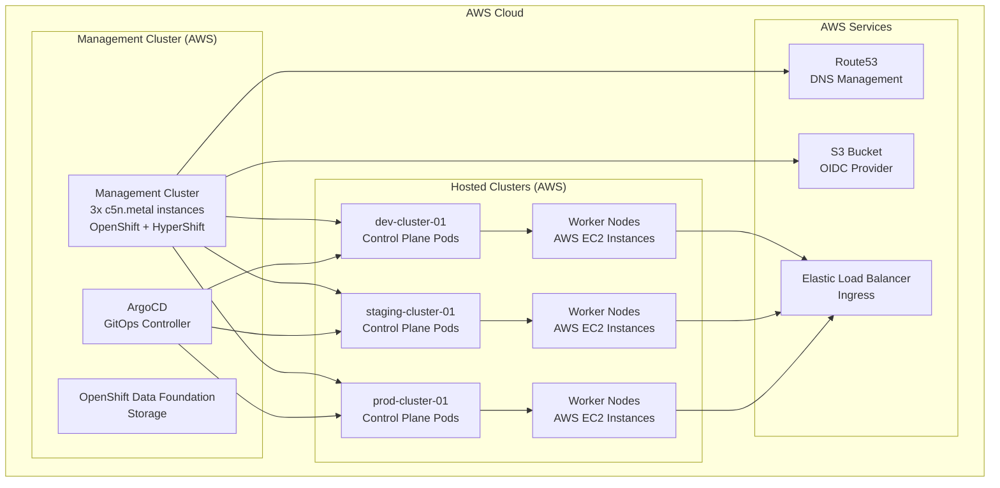
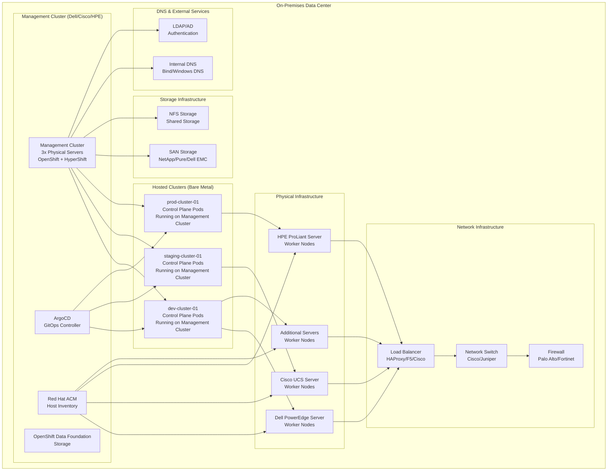

# OpenShift HyperShift Lab Documentation

Welcome to the OpenShift HyperShift Lab documentation! This directory contains comprehensive documentation for the project.

## 🎯 **Primary Documentation** (Start Here)

### **[📖 Complete User Documentation](diataxis/README.md)**
**Comprehensive documentation following the Diátaxis framework** - the main documentation for all users:

- **📚 [Tutorials](diataxis/tutorials/)**: Learning-oriented guides for getting started
- **🛠️ [How-To Guides](diataxis/how-to-guides/)**: Problem-oriented solutions for specific tasks  
- **🔧 [Developer Guides](diataxis/how-to-guides/developer/)**: Contribution-oriented development setup
- **📖 [Reference](diataxis/reference/)**: Information-oriented technical specifications
- **🧠 [Explanations](diataxis/explanations/)**: Understanding-oriented architectural concepts

## 🏗️ **Specialized Documentation**

### **[Modular Hosted Clusters Framework](modular-hosted-clusters/README.md)**
Advanced multi-instance deployment patterns and GitOps automation for scaling hosted clusters.

## 🔧 **Technical Reference Files**

The following files provide specific technical fixes and troubleshooting:

- **[HyperShift Troubleshooting](HYPERSHIFT-TROUBLESHOOTING.md)**: Quick fixes for hosted cluster issues
- **[Ingress Wildcard Policy Fix](hypershift-ingress-wildcard-policy-fix.md)**: Critical fix for hosted cluster consoles
- **[Kustomize Replacements Fix](KUSTOMIZE-REPLACEMENTS-FIX.md)**: Fix for Kustomize parameter replacement issues

## 🏗️ **Architecture Overview**

The OpenShift HyperShift Lab supports two primary deployment architectures:

### **AWS Cloud Deployment**

### **On-Premises Deployment (Dell/Cisco/HPE Infrastructure)**

**Key Architecture Benefits:**
- **🏗️ Centralized Management**: Single management cluster controls multiple hosted clusters
- **🌐 Flexible Deployment**: Choose between AWS cloud or on-premises infrastructure
- **🚀 GitOps Automation**: ArgoCD manages all cluster deployments declaratively
- **📊 Unified Monitoring**: RHACM provides visibility across all clusters
- **🔒 Enterprise Integration**: Integrate with existing enterprise infrastructure (DNS, LDAP, SAN)

**Architecture Implementation Guides:**
- **AWS Cloud Deployment**: Start with the [Getting Started tutorial](diataxis/tutorials/getting-started-cluster.md) for cloud-based deployment
- **On-Premises Deployment**: Follow [Deploy to Bare Metal](diataxis/how-to-guides/deploy-to-bare-metal.md) to deploy on Dell/Cisco/HPE infrastructure

## 🧭 **Navigation Guide**

### **New to the HyperShift Lab?**
Start with **[Getting Started](diataxis/tutorials/getting-started-cluster.md)** to learn the basics.

### **Want to deploy to bare metal?**
Follow **[Deploy to Bare Metal](diataxis/how-to-guides/deploy-to-bare-metal.md)** to extend from AWS to on-premises infrastructure.

### **Want to customize for your environment?**
See **[Fork and Customize](diataxis/how-to-guides/fork-and-customize.md)** to adapt the lab for your infrastructure.

### **Need to solve a specific problem?**
Browse the **[How-To Guides](diataxis/how-to-guides/)** for step-by-step solutions.

### **Looking for technical details?**
Check the **[Reference Documentation](diataxis/reference/)** for complete configuration options.

### **Want to understand the architecture?**
Read the **[Explanations](diataxis/explanations/)** for design decisions and concepts.

### **Contributing to the project?**
Start with **[Development Setup](diataxis/how-to-guides/developer/development-setup.md)**.

## 📋 **Documentation Principles**

This documentation follows the **[Diátaxis framework](https://diataxis.fr/)** which organizes documentation by user needs:

- **Learning** (Tutorials): "I want to learn how to use this"
- **Problem-solving** (How-to guides): "I have a specific problem to solve"  
- **Information** (Reference): "I need to look up specific details"
- **Understanding** (Explanation): "I want to understand how this works"

## 🤝 **Contributing to Documentation**

Documentation contributions are welcome! Please:

1. **Follow the Diátaxis framework** - put content in the right category
2. **Maintain audience separation** - keep end-user and developer docs separate
3. **Use generic examples** - avoid environment-specific details
4. **Test all links** - ensure cross-references work correctly

See **[Development Setup](diataxis/how-to-guides/developer/development-setup.md)** for contribution guidelines.

## 🔗 **External Links**

- **[Main Project Repository](../README.md)**: Project overview and quick start
- **[OpenShift Documentation](https://docs.openshift.com/)**: Official OpenShift documentation
- **[HyperShift Documentation](https://hypershift-docs.netlify.app/)**: Official HyperShift documentation
- **[Red Hat Advanced Cluster Management](https://access.redhat.com/documentation/en-us/red_hat_advanced_cluster_management_for_kubernetes/)**: RHACM documentation

---

**💡 Tip**: The **[Diátaxis documentation](diataxis/README.md)** is your primary resource. The technical reference files in this directory supplement it with specific fixes and troubleshooting information.
