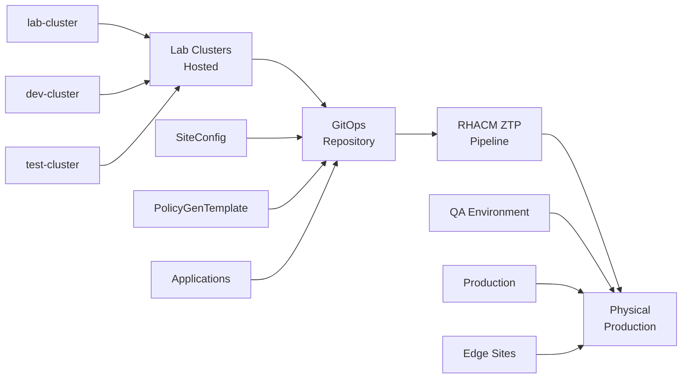

# Tutorial: Enterprise Pipeline Workflow (Lab → Production)

Learn how to implement an enterprise-grade development pipeline using hosted clusters for development and testing, then deploying to physical bare metal infrastructure using RHACM Zero Touch Provisioning (ZTP).

> **⚠️ Implementation Status**: This tutorial describes the target enterprise workflow architecture. The complete pipeline is not yet implemented and requires community contributions. See the [Implementation Status](#implementation-status) section for details.

## Learning Objectives

By the end of this tutorial, you will understand:

- How to use hosted clusters for rapid development and testing
- The enterprise workflow from lab to production
- RHACM ZTP concepts for bare metal deployment
- What components need community implementation
- How to contribute to the enterprise pipeline implementation

## Architecture Overview

This tutorial implements the enterprise pipeline shown in the [Architecture Overview](../../README.md#architecture-overview):



## Prerequisites

### Current Requirements (Available Now)
- OpenShift HyperShift Lab environment deployed
- Basic understanding of OpenShift and GitOps
- Access to the lab environment for testing

### Future Requirements (Community Implementation Needed)
- Physical bare metal infrastructure (Dell/Cisco/HPE)
- RHACM ZTP pipeline components
- Enterprise networking and storage infrastructure

## Phase 1: Lab Environment (Currently Available)

### Step 1: Set Up Hosted Lab Clusters

The current HyperShift Lab provides the foundation for the lab environment:

```bash
# Deploy the foundation cluster (if not already done)
./openshift-3node-baremetal-cluster.sh --domain YOUR-DOMAIN.com --name hub-cluster --bare-metal

# Set up credentials for hosted clusters
oc create namespace virt-creds
oc create secret generic virt-creds \
  --from-file=pullSecret=~/pull-secret.json \
  --from-file=ssh-publickey=~/.ssh/id_rsa.pub \
  -n virt-creds

# Prepare the hub cluster for hosted clusters
# (Follow the preparation steps from the main README)
```

### Step 2: Create Development Hosted Clusters

```bash
# Create lab cluster for experimentation
./scripts/create-hosted-cluster-instance.sh \
  --name lab-cluster \
  --environment lab \
  --replicas 1

# Create development cluster for application development
./scripts/create-hosted-cluster-instance.sh \
  --name dev-cluster \
  --environment dev \
  --replicas 2

# Create test cluster for integration testing
./scripts/create-hosted-cluster-instance.sh \
  --name test-cluster \
  --environment test \
  --replicas 2
```

### Step 3: Develop and Test Applications

```bash
# Access the development cluster
oc get secret dev-cluster-admin-kubeconfig -n clusters \
  -o jsonpath='{.data.kubeconfig}' | base64 -d > dev-cluster-kubeconfig

export KUBECONFIG=dev-cluster-kubeconfig

# Deploy and test your applications
oc create namespace my-app
oc apply -f my-application-manifests/

# Validate application functionality
oc get pods -n my-app
oc logs -f deployment/my-app -n my-app
```

## Phase 2: GitOps Repository (Partially Available)

### Step 4: Prepare GitOps Configurations

The current implementation provides basic GitOps patterns that need extension:

```bash
# Current GitOps structure (available)
gitops/
├── cluster-config/           # Cluster configuration
├── apps/                     # Application definitions
└── overlays/                 # Environment-specific overlays

# Needed for enterprise pipeline (community implementation)
gitops/
├── siteconfigs/             # Physical cluster definitions
├── policygentemplates/      # Cluster policies
├── ztp-pipeline/            # ZTP automation
└── enterprise-apps/         # Production application manifests
```

## Phase 3: RHACM ZTP Pipeline (Community Implementation Needed)

> **🚧 Implementation Needed**: This phase requires community contributions.

### Step 5: Define Physical Infrastructure (Not Yet Implemented)

Example SiteConfig that needs to be implemented:

```yaml
# Example: siteconfigs/production-site.yaml
apiVersion: ran.openshift.io/v1
kind: SiteConfig
metadata:
  name: production-site-01
  namespace: production-site-01
spec:
  baseDomain: "production.company.com"
  pullSecretRef:
    name: "assisted-deployment-pull-secret"
  clusterImageSetNameRef: "openshift-v4.14.0"
  sshPublicKey: "ssh-rsa AAAA..."
  clusters:
  - clusterName: "prod-cluster-01"
    networkType: "OVNKubernetes"
    clusterLabels:
      environment: production
      site: datacenter-01
    nodes:
    - hostName: "dell-server-01.company.com"
      role: "master"
      bmcAddress: "idrac-ip://192.168.1.10/system/1"
      bmcCredentialsName:
        name: "dell-server-01-bmh-secret"
      bootMACAddress: "AA:BB:CC:DD:EE:01"
      bootMode: "UEFI"
      rootDeviceHints:
        deviceName: "/dev/sda"
    # Additional nodes...
```

### Step 6: Define Cluster Policies (Not Yet Implemented)

Example PolicyGenTemplate that needs to be implemented:

```yaml
# Example: policygentemplates/production-policies.yaml
apiVersion: ran.openshift.io/v1
kind: PolicyGenTemplate
metadata:
  name: "production-common-policies"
  namespace: "ztp-policies"
spec:
  bindingRules:
    environment: "production"
  mcp: "master"
  sourceFiles:
    - fileName: "ClusterLogForwarder.yaml"
      policyName: "production-logging"
      spec:
        outputs:
        - name: remote-syslog
          type: syslog
          url: "tcp://syslog.company.com:514"
    - fileName: "PerformanceProfile.yaml"
      policyName: "production-performance"
      spec:
        cpu:
          isolated: "2-19,22-39"
          reserved: "0-1,20-21"
```

## Phase 4: Physical Production (Community Implementation Needed)

> **🚧 Implementation Needed**: This phase requires community contributions.

### Step 7: Deploy to Physical Infrastructure (Not Yet Implemented)

The ZTP pipeline would automatically:

1. **Discover bare metal hosts** using BMC credentials
2. **Provision OpenShift clusters** using SiteConfig specifications
3. **Apply policies** using PolicyGenTemplate resources
4. **Deploy applications** using tested GitOps manifests

### Step 8: Monitor and Validate (Not Yet Implemented)

Enterprise monitoring and validation would include:

- **Cluster health monitoring** across all sites
- **Application deployment validation**
- **Policy compliance checking**
- **Performance monitoring** and alerting

## Implementation Status

### ✅ Currently Available
- **Hub cluster deployment** with RHACM and HyperShift
- **Hosted lab clusters** for development and testing
- **Basic GitOps workflows** with ArgoCD
- **Application development patterns**

### 🚧 Community Implementation Needed

#### High Priority
1. **SiteConfig Templates**: For Dell, Cisco, HPE hardware
2. **PolicyGenTemplate Resources**: Production-ready policies
3. **ZTP Pipeline Scripts**: Automation for bare metal deployment
4. **Integration Examples**: Real enterprise infrastructure

#### Medium Priority
1. **Monitoring Integration**: Enterprise monitoring systems
2. **Network Automation**: Switch and firewall configuration
3. **Storage Integration**: SAN and NFS configuration
4. **Identity Integration**: LDAP/AD authentication

#### Low Priority
1. **Edge Computing**: Single Node OpenShift patterns
2. **Disaster Recovery**: Backup and restore procedures
3. **Compliance Automation**: Security and compliance policies

## Implementation Examples

### Example 1: Gen AI Workload Pipeline

**Use Case**: Develop and test AI applications with GPU time-slicing in hosted clusters, then deploy to dedicated GPU bare metal for production.

```bash
# 1. Test in hosted cluster with GPU time-slicing
./scripts/create-hosted-cluster-instance.sh --name ai-dev --environment dev
oc apply -f ai-app-manifests/ --context ai-dev

# 2. Validate and tune
# - Test model inference performance
# - Validate GPU resource sharing
# - Check memory and storage requirements
# - Test API endpoints and scaling

# 3. Deploy to bare metal (Community Implementation Needed)
# - Create bare metal GPU cluster via RHACM ZTP
# - Apply production configurations with dedicated GPUs
# - Monitor inference performance and costs
# - Scale based on production demand
```

**Cost Benefit**: Use shared GPU resources during development, reserve dedicated GPU infrastructure for production workloads.

### Example 2: Machine Learning Training Pipeline

**Use Case**: Develop ML training pipelines with sample datasets, then scale to full training on high-performance bare metal.

```bash
# 1. Test ML pipeline in hosted cluster with limited resources
./scripts/create-hosted-cluster-instance.sh --name ml-dev --environment dev
oc apply -f ml-pipeline-manifests/ --context ml-dev

# 2. Document requirements and validate workflow
# - Test with small sample datasets (1K-10K rows)
# - Validate data processing pipelines
# - Check storage and compute requirements
# - Test model training and validation workflows

# 3. Deploy to bare metal (Community Implementation Needed)
# - Create high-performance cluster via RHACM ZTP
# - Deploy with full datasets (millions of rows)
# - Use dedicated GPUs and high-speed storage
# - Monitor training performance and resource usage
```

**Cost Benefit**: Validate ML workflows on small scale, then scale to full production training only when ready.

### Example 3: Web Application Pipeline

**Use Case**: Standard web application development and testing workflow.

```bash
# 1. Test in hosted cluster
./scripts/create-hosted-cluster-instance.sh --name web-app-dev --environment dev
oc apply -f web-app-manifests/ --context web-app-dev

# 2. Validate and tune
# - Test load balancing
# - Validate persistent storage
# - Check resource requirements
# - Performance testing with simulated load

# 3. Deploy to bare metal (Community Implementation Needed)
# - Create bare metal cluster via RHACM ZTP
# - Apply tuned configurations
# - Monitor production metrics
# - Scale based on real user traffic
```

### Example 4: Database Workload

**Use Case**: Database development and migration workflow.

```bash
# 1. Test database in hosted cluster with limited resources
./scripts/create-hosted-cluster-instance.sh --name db-dev --environment dev
oc apply -f database-manifests/ --context db-dev

# 2. Document storage and performance requirements
# - Test with sample data
# - Validate backup and restore procedures
# - Check storage IOPS and throughput needs
# - Test high availability configurations

# 3. Deploy to bare metal (Community Implementation Needed)
# - Create bare metal cluster with high-performance storage
# - Deploy with production storage configurations
# - Migrate data from hosted cluster to bare metal
# - Monitor database performance and optimize
```

### Implementation Benefits Summary

| Workload Type | Development Phase | Production Phase | Key Benefit |
|---------------|-------------------|------------------|-------------|
| **Gen AI** | GPU time-slicing | Dedicated GPUs | Cost-effective GPU development |
| **ML Training** | Sample datasets | Full-scale training | Validate before expensive training |
| **Web Apps** | Basic testing | Production load | Standard development workflow |
| **Databases** | Limited resources | High-performance storage | Safe migration and scaling |

**Enterprise Value**: Test and validate everything in cost-effective hosted clusters before deploying to expensive production infrastructure.

## How to Contribute

1. **Choose a Component**: Pick from the implementation needed list
2. **Fork the Repository**: Use the [Fork and Customize guide](../how-to-guides/fork-and-customize.md)
3. **Implement and Test**: Validate with real infrastructure
4. **Document Your Work**: Include examples and troubleshooting
5. **Submit Pull Request**: Share with the community

## Next Steps

- **Current Users**: Start with Phase 1 to set up lab clusters
- **Enterprise Users**: Plan your physical infrastructure requirements
- **Contributors**: Choose a component to implement and contribute
- **Community**: Join discussions about enterprise pipeline patterns

## Related Documentation

- **[Deploy to Bare Metal Guide](../how-to-guides/deploy-to-bare-metal.md)**: Detailed implementation guide
- **[Architecture Overview](../../README.md#architecture-overview)**: Visual architecture diagrams
- **[Fork and Customize](../how-to-guides/fork-and-customize.md)**: How to contribute implementations
- **[Getting Started](getting-started-cluster.md)**: Basic lab setup tutorial

---

**💡 Community Opportunity**: This enterprise pipeline represents a significant opportunity for community contribution. Your implementation could help organizations worldwide adopt this pattern for their OpenShift deployments!
